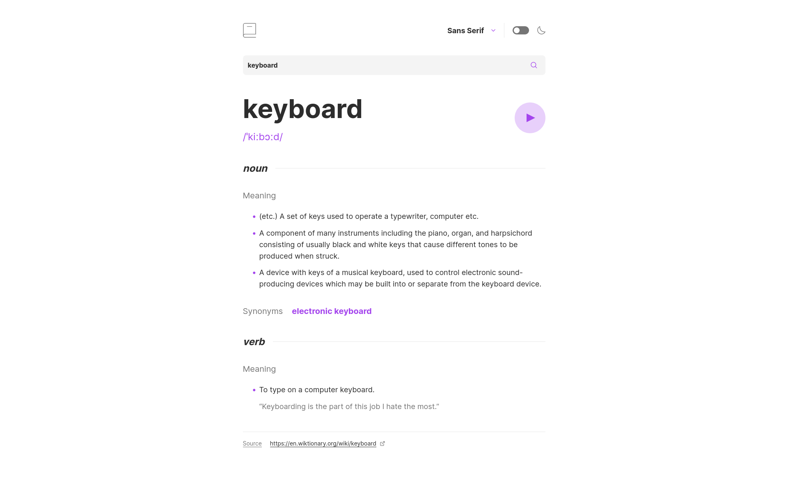

# Frontend Mentor - Dictionary web app solution

This is a solution to the [Dictionary web app challenge on Frontend Mentor](https://www.frontendmentor.io/challenges/dictionary-web-app-h5wwnyuKFL). Frontend Mentor challenges help you improve your coding skills by building realistic projects. 

## Table of contents

- [Overview](#overview)
  - [The challenge](#the-challenge)
  - [Screenshot](#screenshot)
  - [Links](#links)
- [My process](#my-process)
  - [Built with](#built-with)
  - [Useful resources](#useful-resources)
- [Author](#author)

## Overview

### The challenge

Users should be able to:

- Search for words using the input field
- See the Free Dictionary API's response for the searched word
- See a form validation message when trying to submit a blank form
- Play the audio file for a word when it's available
- Switch between serif, sans serif, and monospace fonts
- Switch between light and dark themes
- View the optimal layout for the interface depending on their device's screen size
- See hover and focus states for all interactive elements on the page
- **Bonus**: Have the correct color scheme chosen for them based on their computer preferences. _Hint_: Research `prefers-color-scheme` in CSS.

### Screenshot

### Links

- [GitHub repo](https://github.com/nicoleharaj/dictionary-web-app)
- [Live preview](https://dictionary-web-app-lyart-ten.vercel.app)

## My process

### Built with
- [React](https://reactjs.org/) - JS library
- [Next.js](https://nextjs.org/) - React framework
- [Tailwind CSS](https://tailwindcss.com/) - For styles

### Useful resources

- [Next.js docs](https://nextjs.org/docs) - This helped me get accustomed to version 13 of Next.js
- [Tailwind CSS docs](https://tailwindcss.com) - For style referencing
- [MDN Docs](https://developer.mozilla.org/en-US/) - For JavaScript and HTML reference

## Author

- Website - [Nicole Haraj](https://www.nicoleharaj.dev)
- Frontend Mentor - [@nicoleharaj](https://www.frontendmentor.io/profile/nicoleharaj)